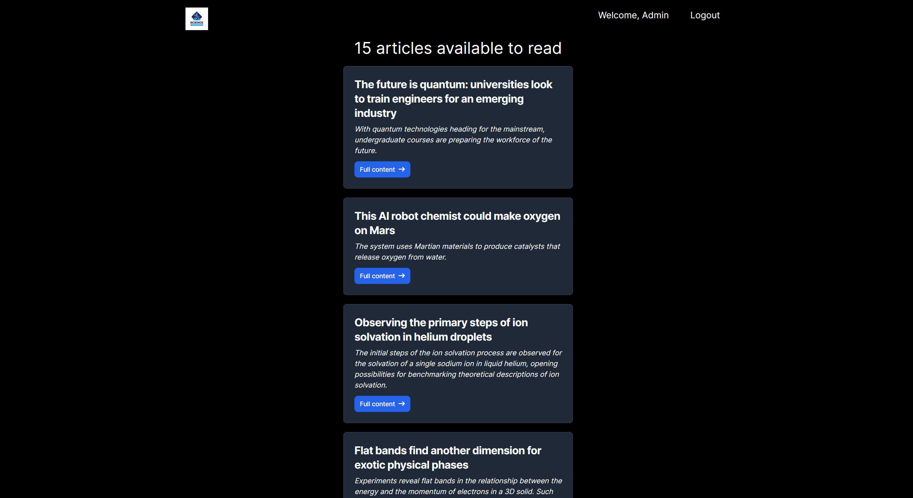
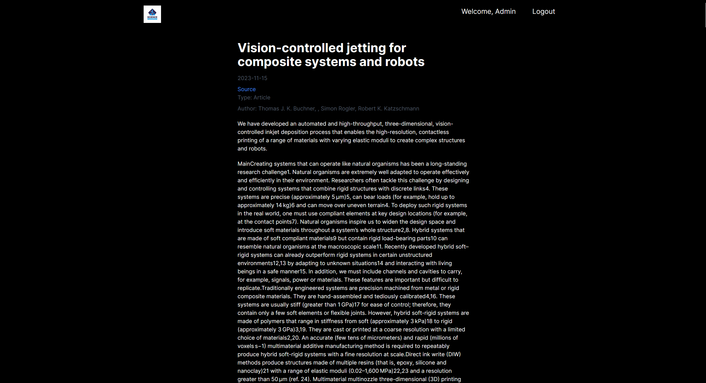
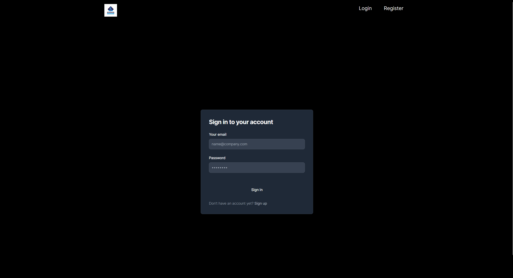
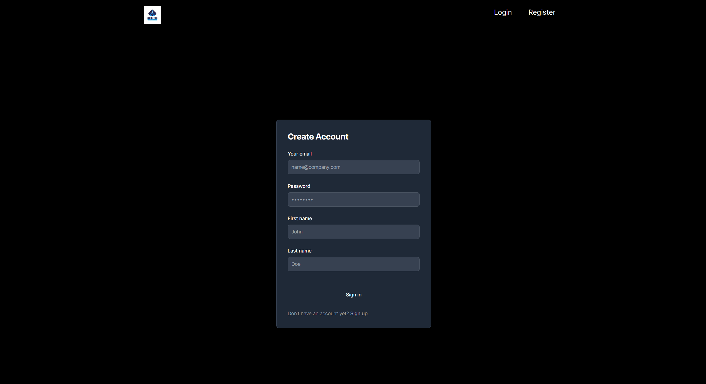

[![Contributors][contributors-shield]][contributors-url]
[![Forks][forks-shield]][forks-url]
[![Stargazers][stars-shield]][stars-url]
[![Issues][issues-shield]][issues-url]
[![MIT License][license-shield]][license-url]
[![LinkedIn][linkedin-shield]][linkedin-url]


<br />
<div align="center">

  <h2 align="center">Science</h3>

  <p align="center">
    Get smarter every day and get access to unlimited content 
    <br />
    <br />
    <a href="https://github.com/DEENUU1/science/issues">Report Bug</a>
    ·
    <a href="https://github.com/DEENUU1/science/issues">Request Feature</a>
  </p>

  <a href="https://github.com/DEENUU1/">

  </a>
</div>






<!-- ABOUT THE PROJECT -->
## About The Project
This project is based on the use of many scripts that collect new articles every day so that you can always be up to date.

Currently, articles are collected from websites such as:
- nature.com
- nationalgeographic.com

The scraper database will be continuously expanded to provide content from many websites on various topics.
### Key Features
1. Scraping and processing data from various websites
2. JWT Authentication 


## Built With

- Python
  - FastAPI
  - Requests 
  - BeautifulSoup
  - Selenium
  - SQLalchemy
- SQLite 
- NextJS (Javascript)

## Installation

### Development 
1. Clone git repository
```bash
git clone https://github.com/DEENUU1/science.git
```

2. Create dotenv file and add required data
```bash
cp .env_example .env
```

3. Install all requirements
```bash
pip install -r requirements.txt
```

4. Run FastAPI application
```bash
uvicorn main:app --reload
```

5. Run NextJS application
```bash
> ./frontend

npm run dev
```


<!-- LICENSE -->
## License

See `LICENSE.txt` for more information.


<!-- MARKDOWN LINKS & IMAGES -->
<!-- https://www.markdownguide.org/basic-syntax/#reference-style-links -->
[contributors-shield]: https://img.shields.io/github/contributors/DEENUU1/science.svg?style=for-the-badge
[contributors-url]: https://github.com/DEENUU1/science/graphs/contributors
[forks-shield]: https://img.shields.io/github/forks/DEENUU1/science.svg?style=for-the-badge
[forks-url]: https://github.com/DEENUU1/science/network/members
[stars-shield]: https://img.shields.io/github/stars/DEENUU1/science.svg?style=for-the-badge
[stars-url]: https://github.com/DEENUU1/science/stargazers
[issues-shield]: https://img.shields.io/github/issues/DEENUU1/science.svg?style=for-the-badge
[issues-url]: https://github.com/DEENUU1/science/issues
[license-shield]: https://img.shields.io/github/license/DEENUU1/science.svg?style=for-the-badge
[license-url]: https://github.com/DEENUU1/science/blob/master/LICENSE.txt
[linkedin-shield]: https://img.shields.io/badge/-LinkedIn-black.svg?style=for-the-badge&logo=linkedin&colorB=555
[linkedin-url]: https://linkedin.com/in/kacper-wlodarczyk
